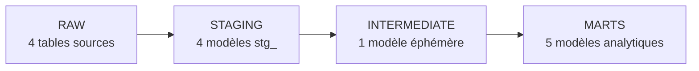

# FINTRACK : pipeline de données financières avec Snowflake et dbt

Pipeline analytique qui transforme quatre tables brutes (comptes, transactions, catégories, budgets) en tables fiables, testées et prêtes pour la BI. Le projet suit une architecture en quatre couches, de `RAW` aux `MARTS`, avec des transformations dbt versionnées et des tests de qualité automatiques.

| 4 | 5 | 12 |
|---|---|---|
| tables sources | modèles analytiques (marts) | tests de qualité (11 génériques + 1 singulier) |

---

## Sommaire

1. [Objectifs](#1-objectifs)
2. [Architecture](#2-architecture)
3. [Structure du projet](#3-structure-du-projet)
4. [Prérequis et installation](#4-prérequis-et-installation)
5. [Environnement Snowflake](#5-environnement-snowflake)
6. [Modèles dbt](#6-modèles-dbt)
7. [Tests et qualité de données](#7-tests-et-qualité-de-données)
8. [Lineage](#8-lineage)
9. [Commandes utiles](#9-commandes-utiles)
10. [Bonus : aller plus loin](#10-bonus--aller-plus-loin)
11. [Rapport : questions de conception](#11-rapport--questions-de-conception)

---

## 1. Objectifs

- **Centraliser** : charger quatre tables sources dans Snowflake.
- **Transformer** : construire des modèles dbt modulaires, organisés en couches successives.
- **Fiabiliser** : garantir unicité, intégrité référentielle et cohérence grâce à des tests automatiques.

## 2. Architecture



| Couche | Schéma | Contenu | Rôle |
|---|---|---|---|
| RAW | `RAW` | 4 tables brutes | Données telles que reçues |
| Staging | `STAGING` | 4 modèles `stg_` | Renommage, typage, nettoyage |
| Intermediate | (éphémère) | `int_transactions_enrichies` | Jointures et enrichissement métier |
| Marts | `MARTS` | 2 dimensions, 1 fait, 2 marts analytiques | Tables finales orientées métier |

Technologies : **Snowflake** (stockage et calcul) et **dbt** (transformations, tests, documentation). Les fonctions `source()` et `ref()` de dbt garantissent l'ordre d'exécution et le lineage automatique.

## 3. Structure du projet

```
fintrack/
├── dbt_project.yml
├── packages.yml                  # bonus : dbt-utils
├── models/
│   ├── staging/
│   │   ├── _stg_sources.yml
│   │   ├── stg_comptes.sql
│   │   ├── stg_transactions.sql
│   │   ├── stg_categories.sql
│   │   └── stg_budgets.sql
│   ├── intermediate/
│   │   └── int_transactions_enrichies.sql
│   └── marts/
│       ├── dim_comptes.sql
│       ├── dim_categories.sql
│       ├── fct_transactions.sql
│       ├── mart_solde_mensuel.sql
│       └── mart_budget_vs_reel.sql
├── tests/
│   └── assert_solde_mensuel_positif.sql
├── snapshots/                    # bonus
│   └── snap_comptes.sql
└── docs/
    └── lineage.png               # capture d'écran de dbt docs
```

> Adaptez cette arborescence à celle de votre dépôt (les fichiers YAML de documentation et de tests peuvent porter d'autres noms).

## 4. Prérequis et installation

**Prérequis**

- Un compte Snowflake avec un rôle autorisé à créer bases, schémas, entrepôts et rôles
- Python 3.9 ou plus
- dbt avec l'adaptateur Snowflake

**Installation**

```bash
pip install dbt-snowflake
git clone <url-du-depot>
cd fintrack
```

**Connexion** : configurez le profil dans `~/.dbt/profiles.yml` (compte, utilisateur, rôle, base `FINTRACK_DB`, entrepôt et schéma). Ne versionnez jamais ce fichier, il contient vos identifiants.

Vérifiez ensuite la connexion :

```bash
dbt debug
```

## 5. Environnement Snowflake

Le script SQL de création de l'environnement met en place :

- une base de données `FINTRACK_DB`
- trois schémas : `RAW`, `STAGING`, `MARTS`
- un entrepôt de taille XS, avec suspension automatique pour maîtriser les coûts
- un rôle et un utilisateur dédiés, avec les droits sur chaque schéma
- les quatre tables sources et leurs données

```sql
CREATE WAREHOUSE <nom_entrepot>
  WITH WAREHOUSE_SIZE = 'XSMALL'
  AUTO_SUSPEND = 60
  AUTO_RESUME = TRUE;
```

**Tables sources (schéma `RAW`)** : `raw_comptes`, `raw_transactions`, `raw_categories`, `raw_budgets`.

## 6. Modèles dbt

### 6.1 Staging

Les sources sont déclarées dans `_stg_sources.yml` et référencées avec `source()`.

| Modèle | Transformations |
|---|---|
| `stg_comptes` | `id` → `compte_id`, `statut` converti en minuscules |
| `stg_transactions` | `id` → `transaction_id`, `date_transaction` castée en `TIMESTAMP_NTZ`, ajout de `montant_signe` (+montant si crédit, −montant si débit, via `CASE WHEN`) |
| `stg_categories` | `id` → `categorie_id`, `nom` → `nom_categorie`, `type` → `type_categorie` (mot réservé SQL évité) |
| `stg_budgets` | `id` → `budget_id`, `mois` garanti en type `DATE` |

### 6.2 Intermediate

`int_transactions_enrichies` joint les transactions avec les comptes et les catégories. Il contient :

- toutes les colonnes de `stg_transactions`
- `nom_client` et `type_compte` (depuis `stg_comptes`)
- `nom_categorie`, `type_categorie` et `groupe` (depuis `stg_categories`)
- `mois_transaction`, premier jour du mois, calculé avec `DATE_TRUNC('month', date_transaction)`

Ce modèle est matérialisé en **`ephemeral`** : aucune table n'est créée, dbt l'injecte comme CTE dans les modèles qui l'utilisent.

### 6.3 Marts

| Modèle | Type | Description |
|---|---|---|
| `dim_comptes` | Dimension | Comptes clients, avec `anciennete_jours` (`DATEDIFF('day', date_ouverture, CURRENT_DATE())`) |
| `dim_categories` | Dimension | Catégories, reprises de `stg_categories` |
| `fct_transactions` | Fait | 12 colonnes, uniquement les transactions avec `statut = 'validee'` |
| `mart_solde_mensuel` | Mart | Par (compte, mois) : crédits, débits, solde net et solde cumulé depuis l'ouverture |
| `mart_budget_vs_reel` | Mart | Par (compte, catégorie, mois) : `montant_prevu`, `montant_reel`, `ecart`, `depassement` |

**Points techniques**

- **Solde cumulé** : `solde_initial` + `SUM(montant_signe) OVER (PARTITION BY compte_id ORDER BY mois)`. La window function évite une auto-jointure.
- **Budget vs réel** : un `FULL OUTER JOIN` entre budgets agrégés et dépenses agrégées ne perd ni les budgets non consommés, ni les dépenses non budgétées.

## 7. Tests et qualité de données

### 7.1 Tests génériques (YAML)

| Modèle | Colonne | Tests |
|---|---|---|
| `stg_comptes` | `compte_id` | `unique`, `not_null` |
| `stg_comptes` | `type_compte` | `accepted_values` : courant, epargne, joint |
| `stg_comptes` | `statut` | `accepted_values` : actif, inactif, cloture |
| `stg_transactions` | `transaction_id` | `unique`, `not_null` |
| `stg_transactions` | `compte_id` | `relationships` → `stg_comptes` |
| `stg_categories` | `categorie_id` | `unique`, `not_null` |
| `fct_transactions` | `transaction_id` | `unique`, `not_null` |

Exemple du test `relationships` :

```yaml
- relationships:
    to: ref('stg_comptes')
    field: compte_id
```

### 7.2 Test singulier (SQL)

`tests/assert_solde_mensuel_positif.sql` vérifie qu'aucun compte `epargne` n'a un solde cumulé négatif. Un test singulier retourne les lignes en erreur : **zéro ligne = test réussi**.

## 8. Lineage

Le lineage complet (sources → staging → intermediate → marts) est généré par dbt docs :

```bash
dbt docs generate
dbt docs serve
```


## 9. Commandes utiles

```bash
dbt deps                 # installer les packages (dbt-utils)
dbt run                  # construire tous les modèles
dbt test                 # exécuter les tests
dbt build                # run + test dans l'ordre des dépendances
dbt snapshot             # exécuter les snapshots
dbt docs generate        # générer la documentation
dbt docs serve           # ouvrir la documentation et le lineage
dbt run --select +fct_transactions   # un modèle et tous ses parents
```

## 10. Bonus : aller plus loin

- **dbt-utils** : installation du package et génération de clés de substitution avec `generate_surrogate_key`.

  ```yaml
  # packages.yml
  packages:
    - package: dbt-labs/dbt_utils
      version: [">=1.0.0", "<2.0.0"]
  ```

- **`mart_top_depenses`** : top 3 des catégories de dépenses par client, avec `ROW_NUMBER() OVER (PARTITION BY compte_id ORDER BY total DESC)` puis `WHERE rang <= 3`.

- **Snapshots** : suivi historique des changements de statut des comptes, avec la stratégie `check` sur la colonne `statut`.

  ```sql
  

  {{
      config(
          target_database = 'FINTRACK_DB',
          target_schema   = 'MARTS',
          unique_key      = 'id',
          strategy        = 'check',
          check_cols      = ['statut']
      )
  }}

  select * from {{ source('raw', 'raw_comptes') }}

  
  ```

  dbt ajoute les colonnes `dbt_valid_from` et `dbt_valid_to` : une `dbt_valid_to` à `NULL` correspond à la version actuelle du compte.

## 11. Rapport : questions de conception

### Quelle différence entre vue, table et éphémère dans dbt ?

Ces trois matérialisations déterminent comment dbt stocke le résultat d'un modèle.

| Matérialisation | Stockage | Avantages | Limites |
|---|---|---|---|
| **Vue** (`view`) | Seule la requête est stockée | Aucun stockage, données toujours à jour | Recalculée à chaque lecture |
| **Table** (`table`) | Résultat stocké physiquement | Lecture rapide | Occupe de l'espace, mise à jour uniquement à chaque `dbt run` |
| **Éphémère** (`ephemeral`) | Aucun objet créé, injecté comme CTE | Pas de stockage, pas d'objet à maintenir | Impossible à interroger directement |

Dans FINTRACK, le modèle intermédiaire est éphémère, car il ne sert qu'à alimenter les marts. Les tables sont réservées aux marts, consultés par les utilisateurs.

### Pourquoi séparer staging, intermediate et marts ?

Chaque couche a une responsabilité unique :

- le **staging** nettoie et normalise chaque source une seule fois (renommage, typage) ;
- l'**intermediate** porte la logique de jointure et d'enrichissement, réutilisable par plusieurs marts ;
- les **marts** exposent des tables finales orientées métier.

Cette séparation évite de dupliquer le nettoyage, facilite le débogage (on sait dans quelle couche chercher une erreur) et limite l'impact d'un changement : si une source évolue, seul le staging est modifié.

### Quel avantage du test `relationships` ?

Il vérifie l'**intégrité référentielle** : par exemple, chaque `compte_id` de `stg_transactions` doit exister dans `stg_comptes`. Il détecte les transactions orphelines avant qu'elles ne faussent les jointures et les indicateurs (soldes, budgets), et fait échouer le pipeline plutôt que de laisser passer des chiffres erronés.
