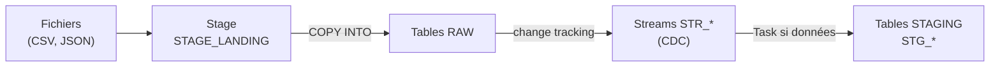
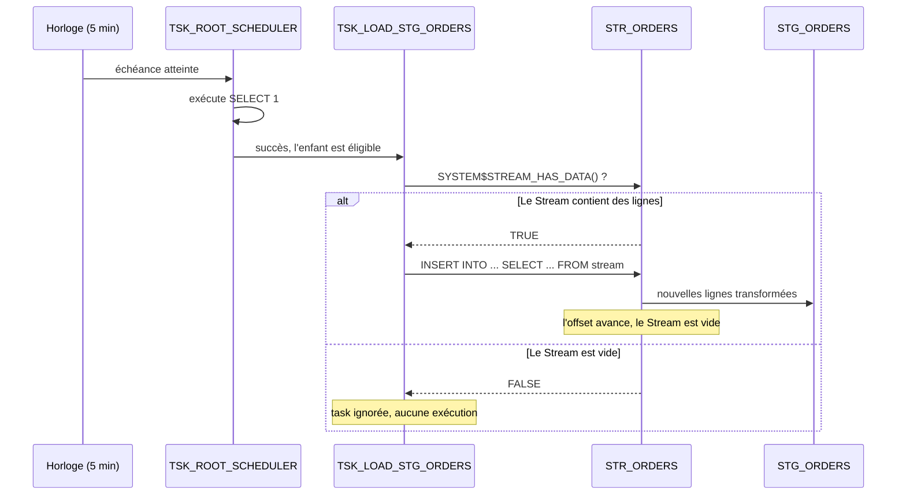

# ShopFlow : pipeline CDC avec Streams et Tasks (Snowflake)

Ce document explique comment fonctionne le pipeline incrémental de ShopFlow : comment les nouvelles données sont détectées (CDC), comment les tasks sont **activées**, et surtout comment elles sont **déclenchées**.

Le code correspondant se trouve dans le notebook `03_streams_tasks.ipynb`.

---

## Sommaire

1. [Vue d'ensemble](#1-vue-densemble)
2. [Prérequis : le change tracking](#2-prérequis--le-change-tracking)
3. [Les Streams : détecter les changements](#3-les-streams--détecter-les-changements)
4. [Les Tasks : le graphe d'exécution (DAG)](#4-les-tasks--le-graphe-dexécution-dag)
5. [Le déclenchement, pas à pas](#5-le-déclenchement-pas-à-pas)
6. [L'activation des tasks](#6-lactivation-des-tasks)
7. [Exécution manuelle](#7-exécution-manuelle)
8. [Tester le pipeline : lot J2](#8-tester-le-pipeline--lot-j2)
9. [Supervision](#9-supervision)
10. [Points d'attention](#10-points-dattention)
11. [Résumé](#11-résumé)

---

## 1. Vue d'ensemble

Sans CDC, il faudrait retransformer 100 % des données RAW à chaque exécution. Avec un Stream, seules les **nouvelles lignes** sont traitées.



| Composant | Objets | Rôle |
|---|---|---|
| Streams | `STR_ORDERS`, `STR_ORDER_ITEMS`, `STR_WEB_EVENTS`, `STR_PRODUCTS`, `STR_CUSTOMERS` | Détectent les lignes insérées dans RAW |
| Task root | `TSK_ROOT_SCHEDULER` | Se réveille toutes les 5 minutes |
| Tasks enfants | `TSK_LOAD_STG_*` (5) | Transforment et chargent STAGING, seulement si leur Stream contient des données |
| Tables cibles | `STG_ORDERS`, `STG_ORDER_ITEMS`, `STG_WEB_EVENTS`, `STG_PRODUCTS`, `STG_CUSTOMERS` | Données nettoyées et typées |

> **Le pipeline fonctionne par interrogation périodique (polling), pas par événement.** L'arrivée d'un fichier ne déclenche rien directement : c'est la task root qui « regarde » toutes les 5 minutes s'il y a du nouveau. La latence maximale est donc d'environ 5 minutes plus le temps d'exécution.

---

## 2. Prérequis : le change tracking

Un Stream lit l'historique des modifications de sa table. Le change tracking doit donc être activé sur chaque table RAW surveillée :

```sql
ALTER TABLE SHOPFLOW_DB.RAW.RAW_ORDERS SET CHANGE_TRACKING = TRUE;
-- idem pour RAW_ORDER_ITEMS, WEB_EVENTS_RAW, PRODUCTS_RAW, RAW_CUSTOMERS
```

---

## 3. Les Streams : détecter les changements

### Création

```sql
CREATE STREAM IF NOT EXISTS SHOPFLOW_DB.RAW.STR_ORDERS
  ON TABLE SHOPFLOW_DB.RAW.RAW_ORDERS
  APPEND_ONLY = TRUE;
```

Un Stream est créé pour chaque table RAW : `STR_ORDERS`, `STR_ORDER_ITEMS`, `STR_WEB_EVENTS`, `STR_PRODUCTS`, `STR_CUSTOMERS`.

### Comment ça marche

- Un Stream **ne stocke aucune donnée**. Il conserve un **offset** : un point de repère dans l'historique de la table source.
- Lire un Stream retourne les lignes ajoutées **depuis cet offset**.
- L'offset n'avance que lorsque le Stream est **consommé par une opération DML** (`INSERT INTO ... SELECT ... FROM stream`) dont la transaction est validée. Un simple `SELECT` pour vérifier le contenu **ne consomme rien**.

### Mode `APPEND_ONLY`

Les cinq Streams sont en `APPEND_ONLY = TRUE` : ils ne capturent que les **`INSERT`**. Les `UPDATE` et `DELETE` effectués dans RAW ne sont pas visibles. C'est cohérent avec un chargement par `COPY INTO` (uniquement des ajouts), et c'est plus léger qu'un Stream standard.

---

## 4. Les Tasks : le graphe d'exécution (DAG)

Les tasks sont organisées en graphe : une **root** planifiée, et cinq **enfants** qui en dépendent.

```
TSK_ROOT_SCHEDULER            (SCHEDULE = '5 MINUTE')
  ├── TSK_LOAD_STG_ORDERS         (AFTER root, WHEN STR_ORDERS a des données)
  ├── TSK_LOAD_STG_ORDER_ITEMS    (AFTER root, WHEN STR_ORDER_ITEMS a des données)
  ├── TSK_LOAD_STG_WEB_EVENTS     (AFTER root, WHEN STR_WEB_EVENTS a des données)
  ├── TSK_LOAD_STG_PRODUCTS       (AFTER root, WHEN STR_PRODUCTS a des données)
  └── TSK_LOAD_STG_CUSTOMERS      (AFTER root, WHEN STR_CUSTOMERS a des données)
```

### La task root : le déclencheur

```sql
CREATE OR REPLACE TASK SHOPFLOW_DB.RAW.TSK_ROOT_SCHEDULER
  WAREHOUSE = WH_TRANSFORM
  SCHEDULE = '5 MINUTE'
AS
  SELECT 1;   -- ne fait rien : sert uniquement de point de départ au DAG
```

Elle ne transforme rien. Son seul rôle est de démarrer le graphe toutes les 5 minutes (`SCHEDULE` par intervalle, pas en CRON).

### Une task enfant : la transformation

```sql
CREATE OR REPLACE TASK SHOPFLOW_DB.RAW.TSK_LOAD_STG_ORDERS
  WAREHOUSE = WH_TRANSFORM
  AFTER SHOPFLOW_DB.RAW.TSK_ROOT_SCHEDULER
  WHEN SYSTEM$STREAM_HAS_DATA('SHOPFLOW_DB.RAW.STR_ORDERS')
AS
  INSERT INTO SHOPFLOW_DB.STAGING.STG_ORDERS (ORDER_ID, CUSTOMER_ID, ORDER_DATE, STATUS, TOTAL_AMOUNT)
  SELECT
    ORDER_ID,
    CUSTOMER_ID,
    TRY_TO_DATE(ORDER_DATE),
    UPPER(TRIM(STATUS)),
    TRY_TO_NUMBER(TOTAL_AMOUNT, 12, 2)
  FROM SHOPFLOW_DB.RAW.STR_ORDERS;
```

Trois mots-clés pilotent le comportement :

| Mot-clé | Effet |
|---|---|
| `AFTER <root>` | La task ne démarre qu'une fois la root terminée avec succès |
| `WHEN SYSTEM$STREAM_HAS_DATA(...)` | La task ne s'exécute que si le Stream contient des lignes non consommées |
| `INSERT INTO ... SELECT ... FROM <stream>` | Consomme le Stream : l'offset avance une fois la transaction validée |

Les cinq enfants sont indépendants entre eux : ils s'exécutent **en parallèle** après la root.

---

## 5. Le déclenchement, pas à pas

Le déclenchement repose sur **deux niveaux de contrôle** :

1. **Le temps** : la root démarre toutes les 5 minutes, quoi qu'il arrive.
2. **La donnée** : chaque enfant ne s'exécute que si son Stream n'est pas vide.



### Scénarios

| Situation à l'échéance des 5 min | Résultat |
|---|---|
| Nouvelles lignes dans `RAW_ORDERS` | `TSK_LOAD_STG_ORDERS` s'exécute et charge `STG_ORDERS`. L'offset avance |
| Aucune nouvelle ligne dans `RAW_ORDERS` | `TSK_LOAD_STG_ORDERS` est ignorée (condition `WHEN` fausse) |
| Nouvelles lignes uniquement dans `RAW_CUSTOMERS` | Seule `TSK_LOAD_STG_CUSTOMERS` s'exécute, les quatre autres sont ignorées |
| L'exécution précédente du graphe n'est pas terminée | Une nouvelle exécution ne démarre pas tant que la précédente est en cours (comportement par défaut) |
| La root est en échec | Aucun enfant ne s'exécute |

Le `WHEN SYSTEM$STREAM_HAS_DATA()` évite les exécutions à vide **des tasks enfants** : on ne mobilise pas le calcul pour transformer zéro ligne.

---

## 6. L'activation des tasks

### Les tasks sont créées suspendues

Une task est créée à l'état **`SUSPENDED`** : elle existe mais ne s'exécute jamais. Il faut l'activer explicitement avec `ALTER TASK ... RESUME`.

### L'ordre compte : enfants d'abord, root ensuite

```sql
-- 1. Enfants
ALTER TASK SHOPFLOW_DB.RAW.TSK_LOAD_STG_ORDERS      RESUME;
ALTER TASK SHOPFLOW_DB.RAW.TSK_LOAD_STG_ORDER_ITEMS RESUME;
ALTER TASK SHOPFLOW_DB.RAW.TSK_LOAD_STG_WEB_EVENTS  RESUME;
ALTER TASK SHOPFLOW_DB.RAW.TSK_LOAD_STG_PRODUCTS    RESUME;
ALTER TASK SHOPFLOW_DB.RAW.TSK_LOAD_STG_CUSTOMERS   RESUME;

-- 2. Root en dernier : c'est elle qui lance le planning
ALTER TASK SHOPFLOW_DB.RAW.TSK_ROOT_SCHEDULER RESUME;
```

**Pourquoi cet ordre ?** La root est la seule task qui possède un planning. Dès qu'elle est activée, le compte à rebours de 5 minutes démarre. Si les enfants étaient encore suspendus à ce moment-là, ils seraient ignorés lors de cette première exécution. En activant les enfants en premier, tout le graphe est prêt quand la root se déclenche.

> Alternative : `SELECT SYSTEM$TASK_DEPENDENTS_ENABLE('SHOPFLOW_DB.RAW.TSK_ROOT_SCHEDULER');` active la root et tous ses dépendants en une seule commande.

### Vérifier l'état

```sql
SHOW TASKS IN SCHEMA SHOPFLOW_DB.RAW;
-- colonne "state" : started = active, suspended = suspendue
```

### Modifier une task

Pour modifier une task du graphe (`CREATE OR REPLACE`, `ALTER`), il faut d'abord **suspendre la root**, faire les modifications, puis réactiver dans le même ordre (enfants puis root) :

```sql
ALTER TASK SHOPFLOW_DB.RAW.TSK_ROOT_SCHEDULER SUSPEND;
-- ... modifications ...
-- puis réactivation : enfants, puis root
```

### Droits nécessaires

Le rôle qui gère les tasks doit avoir le privilège `EXECUTE TASK` sur le compte, ainsi que `OPERATE` sur les tasks pour les activer et les suspendre.

---

## 7. Exécution manuelle

Pour ne pas attendre les 5 minutes (chargement initial, test, débogage) :

```sql
EXECUTE TASK SHOPFLOW_DB.RAW.TSK_ROOT_SCHEDULER;
```

Cela lance immédiatement le graphe. Les conditions `WHEN` s'appliquent toujours : un enfant dont le Stream est vide reste ignoré. Attendez environ 30 secondes que les enfants terminent avant de vérifier les compteurs :

```sql
SELECT 'STG_ORDERS' AS table_name, COUNT(*) AS row_count FROM SHOPFLOW_DB.STAGING.STG_ORDERS
UNION ALL SELECT 'STG_ORDER_ITEMS', COUNT(*) FROM SHOPFLOW_DB.STAGING.STG_ORDER_ITEMS
UNION ALL SELECT 'STG_WEB_EVENTS',  COUNT(*) FROM SHOPFLOW_DB.STAGING.STG_WEB_EVENTS
UNION ALL SELECT 'STG_PRODUCTS',    COUNT(*) FROM SHOPFLOW_DB.STAGING.STG_PRODUCTS
UNION ALL SELECT 'STG_CUSTOMERS',   COUNT(*) FROM SHOPFLOW_DB.STAGING.STG_CUSTOMERS;
```

---

## 8. Tester le pipeline : lot J2

Ce test prouve que le pipeline est **incrémental** : seules les nouvelles données sont transformées.

1. Déposer `orders_j2.csv` et `web_events_j2.json` dans le stage `STAGE_LANDING`.
2. Charger le lot dans RAW avec `COPY INTO` (`RAW_ORDERS` et `WEB_EVENTS_RAW`).
3. Vérifier que les Streams ont capté les nouvelles lignes :

   ```sql
   SELECT 'STR_ORDERS' AS stream_name, COUNT(*) AS pending_rows FROM SHOPFLOW_DB.RAW.STR_ORDERS
   UNION ALL SELECT 'STR_WEB_EVENTS', COUNT(*) FROM SHOPFLOW_DB.RAW.STR_WEB_EVENTS;
   -- ... idem pour les trois autres Streams
   ```

4. Attendre la prochaine échéance de 5 minutes, ou lancer `EXECUTE TASK SHOPFLOW_DB.RAW.TSK_ROOT_SCHEDULER;`.
5. Contrôler l'historique d'exécution, puis les compteurs de STAGING. Seules les lignes du lot J2 ont été ajoutées.

Après consommation, les Streams repassent à `0` ligne en attente.

---

## 9. Supervision

**Historique des exécutions (dernière heure)**

```sql
SELECT NAME, STATE, SCHEDULED_TIME, COMPLETED_TIME, ERROR_CODE, ERROR_MESSAGE
FROM TABLE(SHOPFLOW_DB.INFORMATION_SCHEMA.TASK_HISTORY(
  SCHEDULED_TIME_RANGE_START => DATEADD(HOUR, -1, CURRENT_TIMESTAMP()),
  RESULT_LIMIT => 20
))
WHERE SCHEMA_NAME = 'RAW'
ORDER BY SCHEDULED_TIME DESC;
```

| État | Signification |
|---|---|
| `SUCCEEDED` | La task s'est exécutée correctement |
| `SKIPPED` | Condition `WHEN` fausse (Stream vide) : comportement normal |
| `FAILED` | Erreur : consulter `ERROR_CODE` et `ERROR_MESSAGE` |

**Contenu en attente d'un Stream** (sans le consommer) :

```sql
SELECT COUNT(*) FROM SHOPFLOW_DB.RAW.STR_ORDERS;
SELECT SYSTEM$STREAM_HAS_DATA('SHOPFLOW_DB.RAW.STR_ORDERS');
```

---

## 10. Points d'attention

**Données existantes avant la création d'un Stream.** Un Stream ne « voit » que les lignes insérées après sa création. Les lignes déjà présentes dans RAW à ce moment-là ne sont pas dans le Stream : il faut les charger dans STAGING par un `INSERT INTO ... SELECT` initial sur la table RAW.

**Jointure entre un Stream et une table classique.** `TSK_LOAD_STG_WEB_EVENTS` joint `STR_WEB_EVENTS` à `WEB_EVENTS_EXT`. Si l'événement arrive dans RAW avant sa ligne correspondante dans `WEB_EVENTS_EXT`, la jointure ne retourne rien, mais l'offset avance quand même : l'événement est consommé sans avoir été chargé dans STAGING. Vérifiez que `WEB_EVENTS_EXT` est alimentée en même temps que `WEB_EVENTS_RAW` (y compris pour le lot J2).

**Coût de la task root.** Elle n'a pas de condition `WHEN` : elle s'exécute toutes les 5 minutes et sollicite l'entrepôt même quand aucun Stream n'a de données. Une amélioration possible est de lui ajouter une condition regroupant les cinq Streams :

```sql
WHEN SYSTEM$STREAM_HAS_DATA('SHOPFLOW_DB.RAW.STR_ORDERS')
  OR SYSTEM$STREAM_HAS_DATA('SHOPFLOW_DB.RAW.STR_ORDER_ITEMS')
  OR SYSTEM$STREAM_HAS_DATA('SHOPFLOW_DB.RAW.STR_WEB_EVENTS')
  OR SYSTEM$STREAM_HAS_DATA('SHOPFLOW_DB.RAW.STR_PRODUCTS')
  OR SYSTEM$STREAM_HAS_DATA('SHOPFLOW_DB.RAW.STR_CUSTOMERS')
```

**Stream périmé (stale).** Un Stream qui n'est pas consommé pendant plus longtemps que la période de rétention des données de sa table devient inutilisable. Si les tasks restent suspendues longtemps, il faut recréer le Stream.

**Doublons.** Les tasks font des `INSERT INTO` simples, sans déduplication : si une même ligne est chargée deux fois dans RAW, elle sera insérée deux fois dans STAGING.

---

## 11. Résumé

| Question | Réponse |
|---|---|
| Comment les nouvelles données sont-elles détectées ? | Les Streams `APPEND_ONLY` exposent les lignes insérées depuis leur dernier offset |
| Quand le pipeline se déclenche-t-il ? | Toutes les 5 minutes, via la task root (polling) |
| Qu'est-ce qui décide si une transformation s'exécute ? | `SYSTEM$STREAM_HAS_DATA()` dans la clause `WHEN` de chaque task enfant |
| Comment évite-t-on de retraiter les mêmes lignes ? | La consommation du Stream par un DML fait avancer l'offset |
| Comment activer le pipeline ? | `ALTER TASK ... RESUME` sur les enfants, puis sur la root |
| Comment forcer une exécution immédiate ? | `EXECUTE TASK SHOPFLOW_DB.RAW.TSK_ROOT_SCHEDULER;` |

**Flux complet :**

```
Fichiers → Stage → COPY INTO → RAW → Stream détecte → Task transforme → STAGING
```
